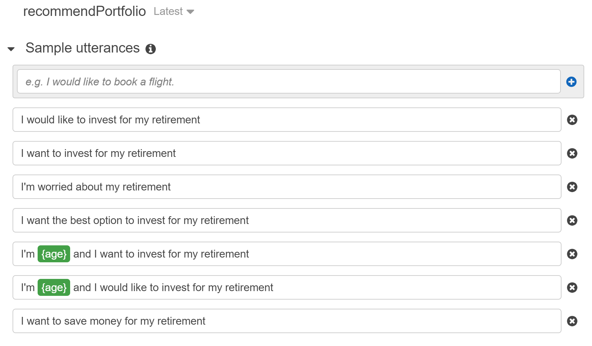
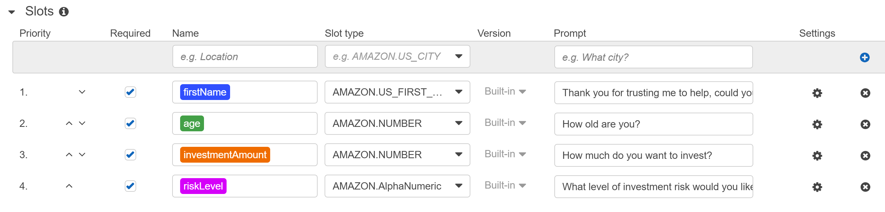
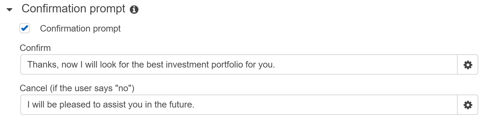
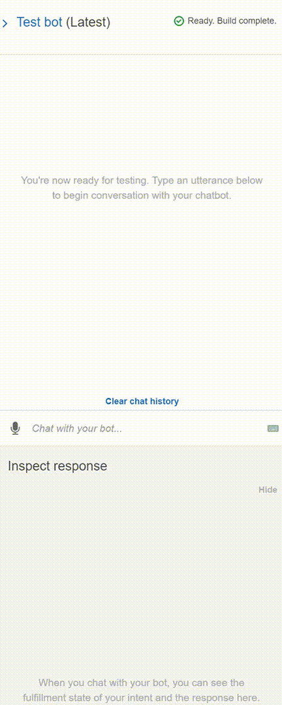
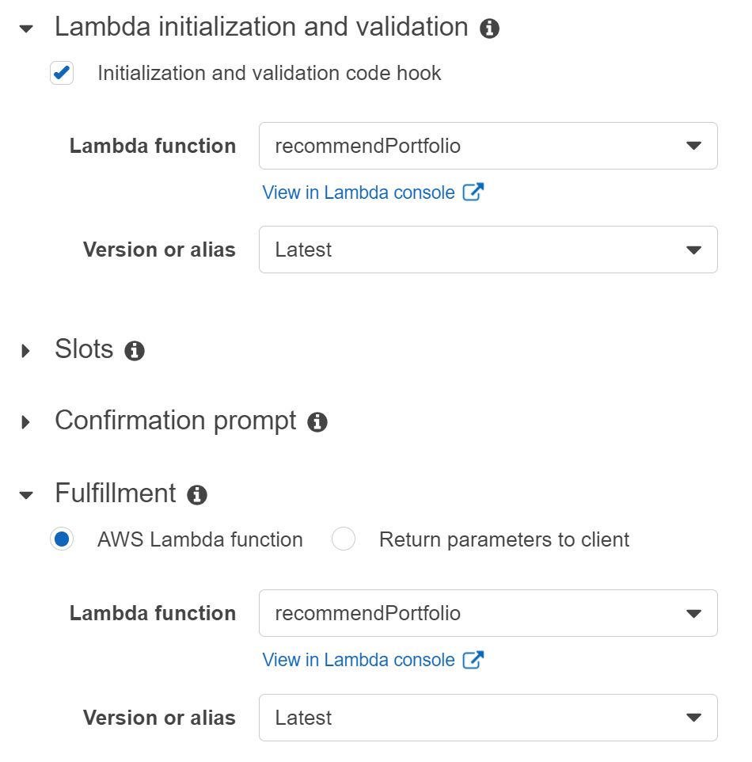
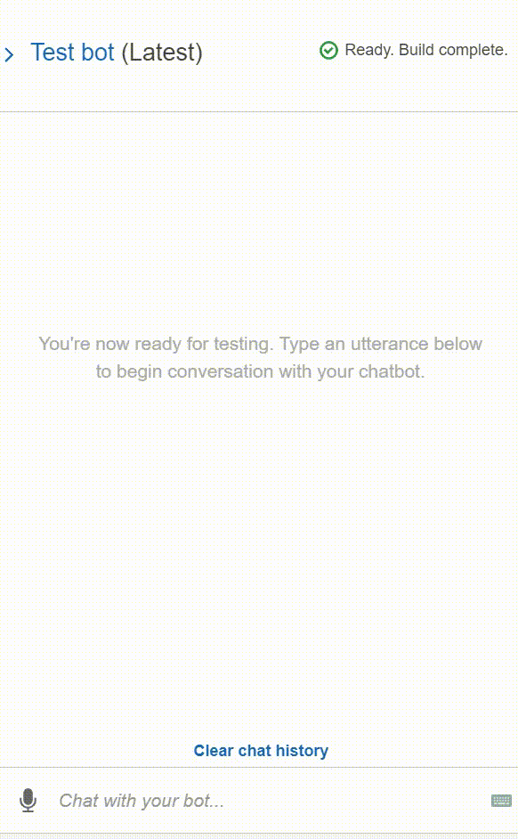

# Amazon Web Services RoboAdvisor

Purpose of this exercise was to create a interactive chatbot AI that can designate a simple investment portfolio type if the following three conditions were satisfied:

* Is the user between the ages of 0 to 65?

* Does the user have a minimum amount of $5,000 to invest?

* What category of risk does this user most closely identify with (None, Low, Medium, High) ?

Bot setup begins with Amazon’s Lex bot interface, where we provide some sample initial statements that will trigger the bot to activate and continue in its script.

We proceed to create four slots which provide the user the ability to interact with the bot to satisfy some qualifications and inform us on a decision.

Assuming all qualficiations / slots inputs were successful, we move onto a confirmation prompt allowing the user to either proceed or cancel the interaction.

The chatbot AI, when run, should look something like this:

To further enhance the functionality of our bot we use Lamda to run some python script where we can perform certain criteria checks, like having an age value between 0 to 65, and investment amount above 5000, or identifying the type of risk level the user will select.

After compiling the code, and running it against some test examples (age is not in range, investment amount is less than minimum, correct dialogue choices), we return back to Lex and integrate the Lambda functionality in the initialization, validation, and fulfillment sections, automating the process.

Rerunning our new chatbot AI, we get the following:

---

## Technologies

This project runs on Amazon Web Services (AWS), with the following functionality:

* [AWS Lambda](https://aws.amazon.com/lambda/) – For creating and running custom script for the RoboAdvisor.

* [Amazon Lex](https://aws.amazon.com/lex/) – Chatbot for interactivity with the client .

---

## Contributors

Santiago Rosas
